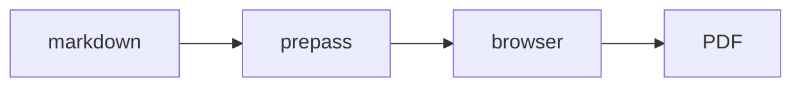

> 🌐 本文档由 [garrytan/gstack](https://github.com/garrytan/gstack) 翻译,英文原版见原项目。

# 如何在文档中放图(并导出 PDF 以外的格式)

本指南介绍 `/make-pdf` 与 `/diagram` 自带的图表 + 多格式引擎(v1.58.0.0+)。这里的一切完全离线运行:mermaid 与 excalidraw 运行时内置于 `lib/diagram-render/`,由 `bin/gstack-render.ts` 加载进浏览器,渲染期间在你的机器上通过回环地址伺服该 bundle。无 CDN,渲染时零网络。浏览器优先用你打开着的 Aside(macOS 15+);没开时——Linux、Windows 或应用关闭——同一个 bundle 在 gstack 自带的浏览器里渲染,因此每个平台都能离线出图(回退引擎出 1x PNG,Aside 出 2x)。

## 在 PDF 里渲染 mermaid 图

在 Markdown 里放一个围栏。就这么简单。

````markdown

````

```bash
make-pdf generate doc.md out.pdf
```

围栏会渲染为**矢量**图(任意缩放都清晰,文字可选),`title` 作为图注与无障碍标签。原始 mermaid 源码以 base64 形式保留在 figure 的 `data-gstack-source` 属性里,便于调试与往返(HTML 注释会破坏 mermaid 的 `-->` 箭头)。一个注意点:围栏必须顶格——缩进的围栏(比如在列表里)按设计保持为普通代码块。

**围栏选项**(信息串里以空格分隔):

| 选项 | 效果 |
|---|---|
| `title="..."` | 图下方的图注 + `aria-label` |
| `render=false` | 保持为普通代码块不渲染 |
| `page=landscape` | 强制此图独占一个横向页 |
| `page=portrait` | 否决此图的自动横向 |

解析失败的围栏渲染成一个醒目的红色诊断块,带解析错误与源码摘录——文档照常构建,错误想看不见都难。

` ```excalidraw ` 围栏同理;正文是完整的 `.excalidraw` 场景文件(excalidraw.com 里 File → Save 保存的东西)。

## 控制图片尺寸与方向

本地图片自动内联(相对路径相对 Markdown 文件解析)且**绝不截断**——每张图都限制在内容框内。超大的照片降采样到打印分辨率(内容宽度下 300dpi),手机照片不会把文档撑爆。

图片安全默认值:远程(http/https)图片默认**被拦截并显示可见占位符**,除非传 `--allow-network`。解析到 Markdown 目录之外的图片路径(即使经过符号链接)仍会内联但大声告警。超过 64MB 的文件和非常规文件(fifo、设备)降级为占位符,不会卡死渲染。

逐图指令紧跟在图片后:

```markdown
{width=full}
{width=2in}
{page=landscape}
{page=portrait}
```

`width=` 接受 `full`、百分比(`50%`)或尺寸(`3in`、`8cm`、`200px`)。`page=` 强制或否决专属横向页。

**自动横向:**宽、字小、像图表的图片自动获得一页垂直居中的横向页——文档其余部分仍是纵向。启发式刻意保守(宽高比 ≥ 1.8、固有宽度超过内容框约 2.5 倍、alt 词含图表类词:diagram / architecture / flowchart / chart / graph)。该触发没触发时加 `{page=landscape}`;不该触发却触发了,加 `{page=portrait}`。

## 导出单文件 HTML 或 Word

```bash
make-pdf generate doc.md out.html --to html
make-pdf generate doc.md out.docx --to docx
```

- **`--to html`** 输出单个自包含文件:图为内联 SVG,图片为 data URI,零网络引用(默认离线姿态下;`--allow-network` 会刻意保留远程图片标签),外加阅读优化层(居中栏宽、内边距)。发邮件、传附件、随地打开都行。
- **`--to docx`** 是内容保真导出:标题、表格、代码块、列表、图表(以 300dpi PNG 加 alt 文本嵌入)都能带过去。逐像素完美的版式带不过去——打开后那是 Word 的活。

注意:`--to` 是输出格式。`--format` 是 `--page-size` 的旧别名——两码事。

## 从一句自然语言生成图

```
/diagram make a flowchart of our deploy pipeline: build, test, canary, promote
```

该 skill 撰写 mermaid 并产出**三件套**:

| 文件 | 用途 |
|---|---|
| `<slug>.mmd` | 事实源——编辑后重新渲染 |
| `<slug>.excalidraw` | 在 excalidraw.com 打开(File → Open),挪动方框后再交回 |
| `<slug>.svg` / `<slug>.png` | 文档、issue、README、聊天 |

流程图可转为完全可编辑的 excalidraw 场景。其他 mermaid 类型(sequence、state、gantt)渲染 SVG/PNG 没问题,但跳过 `.excalidraw` 工件——上游转换器的限制,skill 会告诉你。

写文档时,把 `.mmd` 源码嵌进 Markdown 而不是贴 PNG——`/make-pdf` 会渲染成矢量,图永远可编辑。

## CI:响亮失败,而不是带占位符上线

```bash
make-pdf generate docs.md --strict
```

本地图片缺失、远程图片被拦、目录外图片读取(路径或符号链接解析到 Markdown 目录之外)、超大文件(>64MB)、非常规文件,全部以非零码退出,而不是降级为警告或占位符——适用于"坏图就该断构建"的文档流水线。

## 故障排查

- **"diagram-render bundle not found"** → 在 gstack 仓库里跑 `bun run build:diagram-render`,或重跑 `./setup`。
- **图渲染了但内联显示被压扁** → 图太宽;给围栏加 `page=landscape` 让它铺开。
- **图变成两行的"跑道"环而不是一条长线:**mermaid subgraph 技巧——顶层用 `flowchart TB`,两个 subgraph 分别 `direction LR` 和 `direction RL`,然后连接 **subgraph**(跨 subgraph 边界的节点级连线会静默禁用 `direction`)。
- **"[remote image blocked]" 占位符** → 默认绝不抓取远程图片(离线姿态);标签被替换为可见占位符,打印时浏览器也抓不到。传 `--allow-network` 可显式开启。
